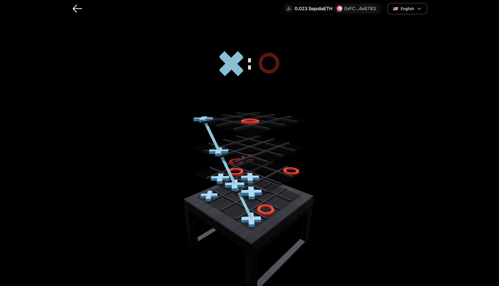

# ft_transcendence

This is a project we've created at 42. It is a web app built with Next.js and NextUI. It utilizes blockchain technology for features such as user authentication and user management. The platform also includes visually engaging 3D games like Pong and TicTacToe, developed using R3F to enhance the user experience and more.

## Modules Implemented

- ### Web

  - **Major module: Store tournament scores on the Blockchain**
  
    > Integrates blockchain technology into the Pong website to securely store tournament scores. Uses Ethereum's testing blockchain and Solidity for smart contracts.

- ### Gameplay and User Experience

  - **Major module: Remote players**

    > Enables two distant players, each located on separate computers, to access the same website and participate in the same Pong game.

  - **Major module: Multiplayers (more than 2 in the same game)**
  
    > Enables more than two players to participate simultaneously in the same game, each with live control. Customizable gameplay mechanics for different numbers of players.

  - **Major module: New Game with History Tracking and Matchmaking**
  
    > Introduces a new game with user history tracking and matchmaking for an enhanced user experience.

  - **Minor module: Game Customization Options**
  
    > Provides customization features for all games on the platform.

- ### AI-Algo

  - **Major module: Introduce AI Opponent**
  
    > Adds AI player with human-like behavior for challenging gameplay. Goals: Strategic decision-making without A* algorithm. Adaptability to various scenarios.

- ### Devops

  - **Major module: Infrastructure Setup for Log Management**
  
    > Establishes robust log management using ELK stack (Elasticsearch, Logstash, Kibana), deploying Elasticsearch for storage, configuring Logstash for data processing, setting up Kibana for visualization, defining retention policies, and implementing security measures.

  - **Major module: Designing the Backend as Microservices**
  
    > Architect backend using microservices. Divide into smaller, loosely-coupled microservices. Define clear boundaries and interfaces. Implement communication mechanisms. Ensure each handles a single, well-defined task.

- ### Graphics

  - **Major module: Use of advanced 3D techniques**
  
    > Introduces advanced 3D techniques using ThreeJS/WebGL for immersive visuals in Pong game. Enhances gameplay experience and revolutionizes visual elements.

- ### Accessibility

  - **Minor module: Expanding Browser Compatibility**
  
    > Expands browser compatibility by adding support for an additional web browser. Ensures seamless access and usage for users. Thorough testing and optimization for consistent user experience.

  - **Minor module: Multiple language support**
  
    > Implements support for multiple languages on the website to cater to a diverse audience. Includes a language switcher for easy language selection. Translates essential content into supported languages for seamless navigation and interaction.

- ### Server-Side Pong

  - **Major module: Enabling Pong Gameplay via CLI against Web Users with API Integration**
  
    > Develop a Command-Line Interface (CLI) to play Pong against web users, integrating with the web application via API. Enables CLI users to join and interact with web players, with features including user authentication and real-time synchronization.

### Total: 10.5 / 9.5 Modules ✅

## Installation

Use the package manager [pip](https://pip.pypa.io/en/stable/) to install the requirements for the cli-client.

```bash
cd cli-client
pip install -r requirements.txt
```

## Usage

### Main Project

1. Navigate to the project's main directory.
2. Run `make` in your terminal to set up the project.
3. Connect to localhost.
4. Log in with your wallet or use the Guest feature.

**Note:** As a Guest, you will not have access to the following features:
- Tournaments
- Matchmaking
- Color and name customization

### Crypto Wallet

To utilize all features, you need a crypto wallet with free testnet tokens.

**Setup MetaMask:**

1. **Download MetaMask:**
   - Via Chrome extension: [MetaMask on Chrome Web Store](https://chromewebstore.google.com/detail/metamask/nkbihfbeogaeaoehlefnkodbefgpgknn?hl=de)
   - Via Website: [MetaMask Official Site](https://metamask.io/download/)

2. **Create an Account or Log In.**

3. **Configure the Sepolia Base Testnet:**
   - Open the MetaMask browser extension.
   - Click the network selection dropdown menu at the top of the extension.
   - Click "Add Network."
   - Select "Add a Network Manually."

   Enter the following details:

   | **Field**         | **Value**                |
   |-------------------|--------------------------|
   | Network Name      | SepoliaBase              |
   | New RPC URL       | https://sepolia.base.org |
   | Chain ID          | 84532                    |
   | Currency Symbol   | SepoliaETH               |

   Click "Save" and switch to the SepoliaBase network.

### Tokens

To start, you'll need testnet tokens:

1. Visit this https://faucet.triangleplatform.com/base/sepolia
2. Enter your wallet address (found in MetaMask under your account name, starting with 0x).

If you encounter issues, search for "Base Sepolia Faucets" and try other available faucets.

---
**CLI-tool:**

```bash
cd cli-client
python3 main.py -host [hostname]
```
For help, you can use:
```bash
python3 main.py -h
```

## Showcase


### TicTacToe ❌




### Pong 🏓


## Credits 🔑

The 3D model used in this project, titled "wallet.fbx," was created by [vijay verma](https://sketchfab.com/realvjy) and is licensed under [CC-BY-4.0](http://creativecommons.org/licenses/by/4.0/). You can find the original model [here](https://sketchfab.com/3d-models/walletfbx-4d63cef3d4c3430dae23c964cc3f1608).
